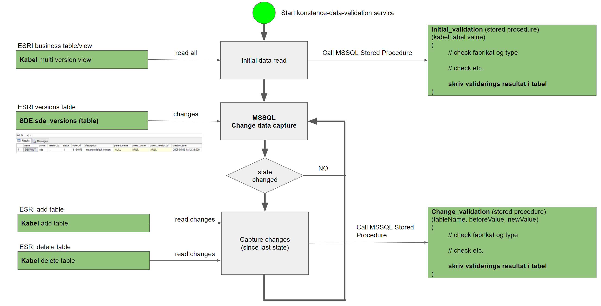

# Arcgis integrator

## Publish console app local directory for Windows x64

```sh
dotnet publish src/ArcgisIntegrator.Console/ArcgisIntegrator.Console.csproj --sc --runtime win-x64 -o ./publish
```

## Running database for tests in docker.

```sh
docker run -e "ACCEPT_EULA=Y" -e "SA_PASSWORD=myAwesomePassword1" -e "MSSQL_AGENT_ENABLED=True"  -p 1433:1433 -d  mcr.microsoft.com/mssql/server:2019-CU13-ubuntu-20.04
```

## Tests

### Running all tests

```sh
dotnet test
```

### Running unit tests

```sh
dotnet test --filter Category=Unit
```

### Running integration tests

```sh
dotnet test --filter Category=Integration
```

## Overview image

The overview image shows an example of how the library can be used.


